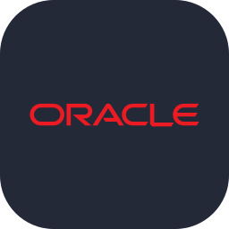

# 👋 Olá, sou Caio Darin Geraldi

### Desenvolvedor de Software • Back-end • Engenharia de Software

🎓 Cursando **Técnico em Desenvolvimento de Sistemas — ETEC Alberto Feres | AMS**

💻 Foco em **back-end, arquitetura, modularidade e qualidade de software**

🧠 Gosto de entender não apenas **como** uma tecnologia funciona, mas também **por que** utilizá-la e quais decisões de engenharia existem por trás dela.

 

---

## 👨‍💻 Sobre mim

Sou estudante de **Desenvolvimento de Sistemas** com interesse principal em **Engenharia de Software e desenvolvimento back-end**.

Busco construir aplicações que não apenas funcionem, mas que sejam **modulares, bem estruturadas, documentadas, testáveis e preparadas para evoluir**.

---

## 🛠️ Tecnologias que utilizo

---

## 📚 Estudando e aprofundando

### 📖 Lendo atualmente: 
* Código Limpo - Habilidades Práticas do Agile Software (Robert C. Martin)

---

## 💼 Experiência profissional

### Soma Soluções — Estágio em Desenvolvimento de Sistemas

Durante meu estágio na **Soma Soluções**, tive experiência profissional com desenvolvimento e manutenção de sistemas utilizando **Delphi / Object Pascal** e **Oracle Database**.

&nbsp;

 

Oracle Database &nbsp;•&nbsp; Delphi / Object Pascal

---

## 🧠 Áreas de interesse

- Engenharia de Software
- Arquitetura de Software
- Desenvolvimento Back-end
- Sistemas Modulares
- Modelagem de Domínio
- Engenharia de Requisitos
- Banco de Dados
- Testes e Qualidade de Software
- Linux e Infraestrutura
- Inteligência Artificial aplicada ao desenvolvimento

---

## 🚀 Projetos em destaque

### 🧩 Fractaw Modules

ERP modular desenvolvido com foco em **Django, Engenharia de Software e arquitetura modular**.

`Python` · `Django` · `Arquitetura Modular` · `Modelagem de Domínio`

### 📝 Intelligent Markdown IDE

Projeto experimental de uma IDE **local-first**, utilizando Markdown como fonte de verdade e explorando arquitetura de software, Git nativo e integração com IA local.

`Rust` · `Tauri` · `Svelte` · `TypeScript` · `SQLite` · `Git`

---

### 🌐 Contato

  

**Construindo software com foco em arquitetura, modularidade e evolução sustentável.**

